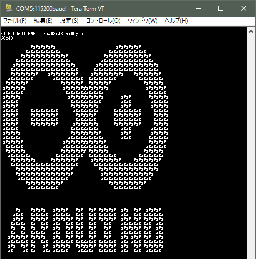
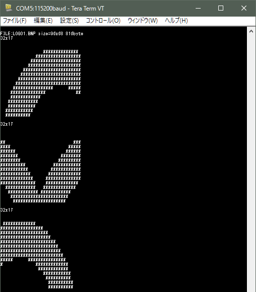

# Arduino用Bitmap画像ロードライブラリ

## 概要
SDカードに保存されているモノクロ(２色）ビットマップファイル画像データを利用するためのライブラリです。  
指定したビットマップファイルの全部または、指定領域のデータを取り出してメモリーにロードします。

## ライブラリ名称
**sdbitmap** (ヘッダーファイル sdbitmap.h)

## 特徴・制約等
- 画像ファイルとしてWindowsビットマップファイル（モノクロ 無圧縮）を対象とします。
- 任意の画像サイズをサポートします。

## 利用環境
- Arduino Unoまたはその互換機
- 開発環境 Arduino IDE 1.6.5以降
- SPI接続、SDライブラリによるSDカードの利用ができること

## ハードウェア構成
- SPI接続にてSDカードを接続、SDライブラリにてアクセス出来ること

## インストール
* sdbitmap フォルダをArduinoのliblaryにコピーする。
* サンプルスケッチを動かすには exsample/sdbitmap_sample/bitmap/フォルダの2つ画像をSDカードに入れる

## ライブラリリファレンス
ライブラリはクラスライブラリとして提供しています。 
sdbitmapクラスよりインスタンスを生成し利用して下さい。  
SPI接続のSDカードの初期化を利用前に行う必要があります。  

**ヘッダファイル**  
   `#include <sdbitmap.h>`

**クラス名**  
  sdbitmap

**メンバー関数一覧**  
- コンストラクタ  
  `sdbitmap()`  
  クラスインスタンスを生成しinit()を呼び出して初期化を行います。  
  利用例： `sdbitmap  bitmap;`  

- インスタンスの初期化  
  `void init()`  
  インスタンスの初期化を行います。通常はコンストラクタ呼び出されて利用されます。  

- ビットマップファイル名の設定  
  `void setFilename(char* str)`    
  利用するビットマップファイル名をstrにて設定します。    
  
- ビットマップのオープン    
	`uint8_t open()`  
  設定したビットマップファイルをオープンします。  
  オープン時にビットマップファイルの形式をチェックし、異常があればエラーを返します。  
  戻り値： 正常終了 0、 異常終了 1  

- ビットマップのクローズ    
	`void	close()`  
  オープンしたビットマップファイルをクローズします。  

- ビットマップ画像の横サイズの取得  
  `int16_t getWidth()`  
  現在オープンしているビットマップファイル画像の横サイズをピクセル数で返します。  

- ビットマップ画像の縦サイズの取得  
	`int16_t getHeight()`
  現在オープンしているビットマップファイル画像の縦サイズをピクセル数で返します。  

- ビットマップ画像の画像部のサイズの取得  
	`uint32_t getImageSize()`  
  現在オープンしているビットマップファイル画像のサイズをバイト数で返します。 

- ビットマップデータの取得  
	`uint8_t getBitmap(uint8_t*bmp, uint8_t mode)`
  現在オープンしているビットマップファイル画像データを取得します。  
  引数  
    bmp ：画像データ格納アドレス  
    mode：モード設定 0:無加工 1:反転  

- ビットマップデータの切り出し取得(高速版)  
	`int8_t getBitmap(uint8_t*bmp, uint16_t x, uint16_t y, uint8_t w, uint8_t h, uint8_t mode)`  
  現在オープンしているビットマップファイル画像データを部分取得します。  

  引数  
    bmp ：画像データ格納アドレス  
    x   ：取り出し開始位置 横(ピクセル)  8の倍数であること
    y   ：取り出し開始位置 縦(ピクセル)  
    w   ：取り出し横幅(ピクセル)  8の倍数であること
    h   ：取り出し縦幅(ピクセル)  
    mode：モード設定 0:無加工 1:反転  

  ※高速化のためにバイト単位で取り出します。そのためx、wは8の倍数である必要があります。  

- ビットマップデータの切り出し取得  
	`int8_t getBitmapEx(uint8_t*bmp, uint16_t x, uint16_t y, uint8_t w, uint8_t h, uint8_t mode)`  
  現在オープンしているビットマップファイル画像データを部分取得します。  
  
  引数  
    bmp ：画像データ格納アドレス  
    x   ：取り出し開始位置 横(ピクセル) 
    y   ：取り出し開始位置 縦(ピクセル)  
    w   ：取り出し横幅(ピクセル) 
    h   ：取り出し縦幅(ピクセル)  
    mode：モード設定 0:無加工 1:反転  

  ※getBitmap()に比べビットシフト処理を行うためsパフォーマンスは落ちますが、ビット単位で指定出来ます。  
  
## サンプルソースの解説  
サンプルスケッチ `sdbitmap_sample.ino`は指定した2つのビットマップファイル読んで画像パターンをコンソール出力します。 

サンプルスケッチ内の関数`test1()`では、画像ファイル`LOGO2.BMP`を全てロードしてそのパターンを表示しています。  
サンプルスケッチ内の関数`test2()`では、画像ファイル`LOGO1.BMP`を部分ロードしてそのパターンを表示しています。  

利用画像ファイル  
  
  

サンプルスケッチの実行結果  
  
      

